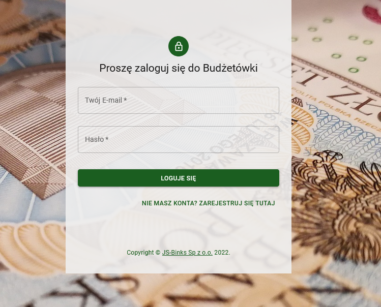
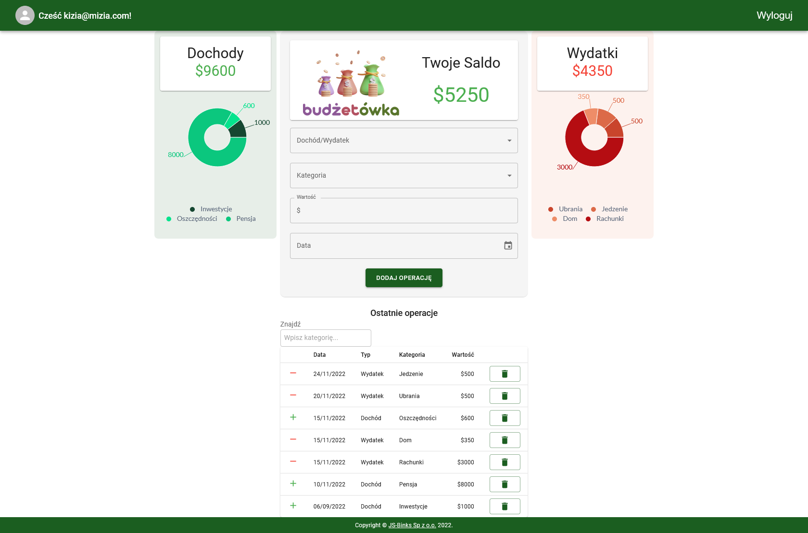

# Budżetówka - aplikacja do zarządzania budżetem

Aplikacja przygotowana jako finałowy projekt grupowy w ramach Bootcampu [Frontend z Reactem w infoShare Academy](https://infoshareacademy.com/kurs/bootcamp-frontend/)

Nad projektem pracowali:
- [Izabela Blinkiewicz](https://github.com/izamarciniak123)
- [Bartłomiej Frąk](https://github.com/bartlomiej-fr)
- [Andrzej Bułeczka](https://github.com/AndrzejBuleczka)
- [Paweł Kenar](https://github.com/Pinkfloyd123)

Wykorzystane technologie:

- React z React Router
- TypeScript
- Firebase
- Material UI

Aplikacja umożliwia dodawanie dochodzów i wydatków w ramach dostosowanych kategorii, na bieżąco informując użytkownika o aktualnym saldzie i graficznie prezentując wydatki i przychody.

Prosty ekran logowania:

Panel główny:

[link do aplikacji](https://budzetowka.netlify.app/)